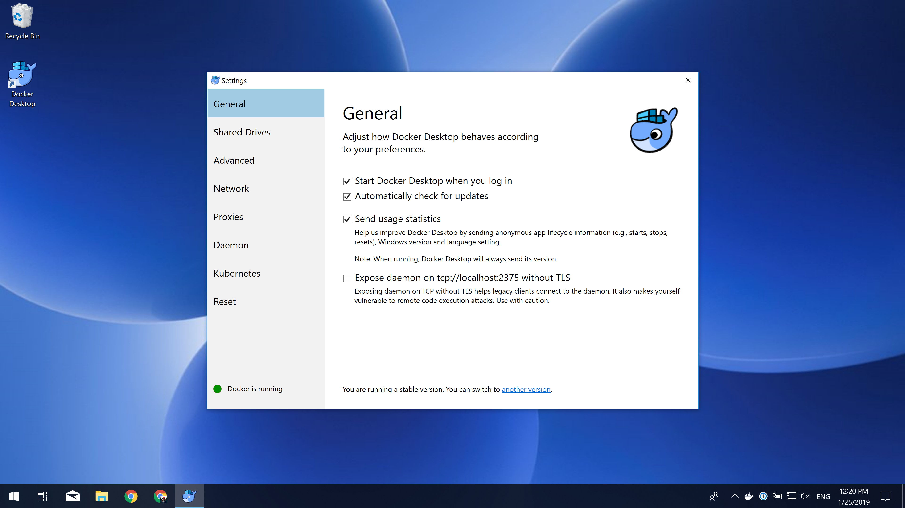
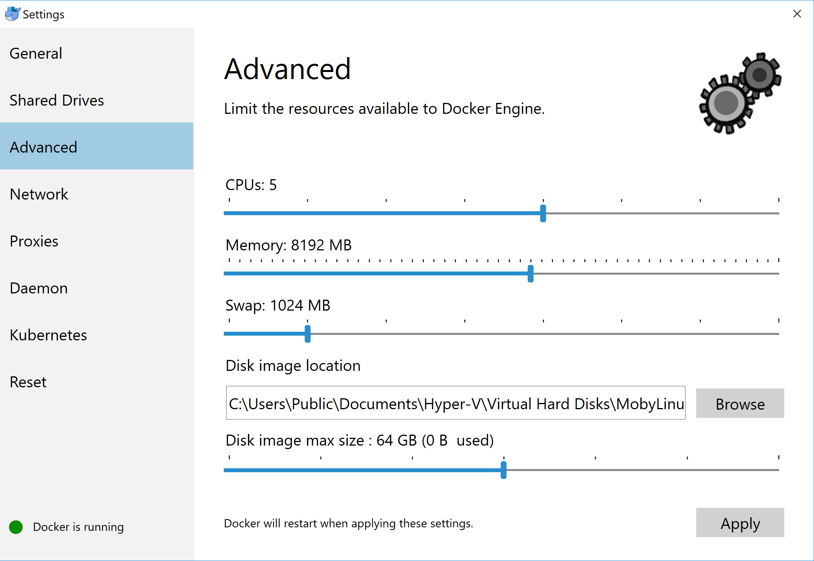
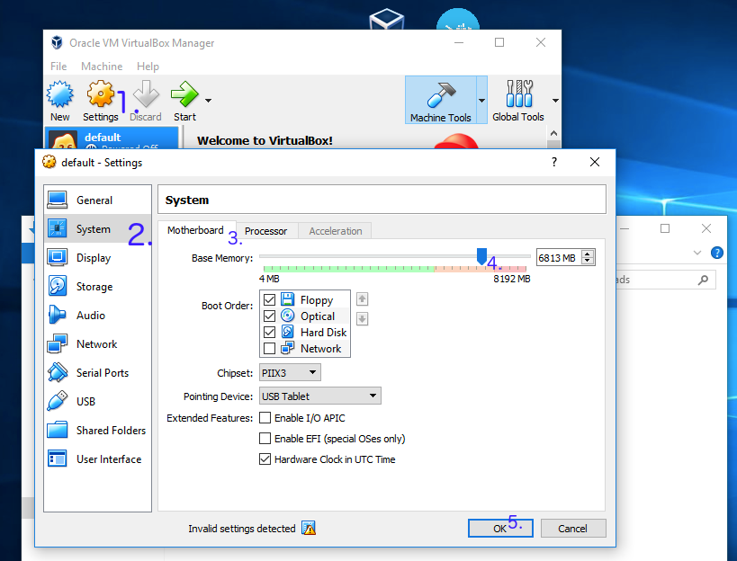

---
---

# Install Docker In Microsoft Windows

## Windows Docker Desktop (recommended)

An official guide for Windows Docker Desktop could be found [here](https://docs.docker.com/docker-for-windows/install/).

Download the image from [this link](https://hub.docker.com/editions/community/docker-ce-desktop-windows) and follow the installer one by one.

**Windows Docker Desktop requires Windows 10 Pro or Enterprise version 1586/2016 RTM or above**

If your windows is not fulfill the prerequisite, you may see the image as follow. Please use *Docker Toolbox on Windows* instead.

Once you successfully installed docker desktop, you may click the button "Docker Desktop". It may take a few minutes to start the service. You may keep a watch on the whale on the right button.

Double click the whale button, we may able to find a window to modify some of the properties.

Please go to the advanced tab, and click the drivers **you wish to share with the docker container**. Note: if your homework is located on Disk-D, you may not select Disk-C, this could make your operation system more safe.

Going to the advanced tab, and you can edit the maximum memory used by docker.

If you can execute command `docker ps -a` and `docker-compose` normally, and no error message returned. Your configuration is fine.

## Docker Toolbox on Windows

You may install [Docker Toolbox on Windows](https://docs.docker.com/toolbox/toolbox_install_windows/) instead.

Going to the instruction page, click '[Get Docker Toolbox for Windows](https://download.docker.com/win/stable/DockerToolbox.exe)', you will download a installer. You are supposed to install Docker and VirtualBox during this wizard.

Click 'Docker Quickstart Terminal', you should able to start a bash session. Close it, click virtual box. You may find there is one virtual machine is in running. Close this machine, update the maximum base memory.

Click the 'Docker Quickstart Terminal' and your docker is ready.

### FAQ

##### **Q:**  VirtualBox won't boot a 64bits VM when Hyper-V is activated

You may meet message as follow:

> Error with pre-create check: "This computer is running Hyper-V. VirtualBox won't boot a 64bits VM when Hyper-V is activated.
> Either use Hyper-V as a driver, or disable the Hyper-V hypervisor. (To skip this check, use --virtualbox-no-vtx-check)

You can’t run VirtualBox on a Hyper-V enabled system. Hyper-V is a tier-1 hypervisor, which doesn’t accept other hypervisors (from [here](https://forums.docker.com/t/unable-to-run-the-docker-toolbox/37403/3))

1. It seems like Docker for Windows has already resolved this issue
2. Try to [disable Hyper-V](https://superuser.com/questions/540055/convenient-way-to-enable-disable-hyper-v-in-windows-8). **Caution:** According to some reports, this operation may damage his/her network and had to reinstall all network adapters to get Internet back, or even getting a blue screen error.
3. Try to use hyperv as your backend driver. [https://docs.docker.com/machine/drivers/hyper-v/](https://docs.docker.com/machine/drivers/hyper-v/)
