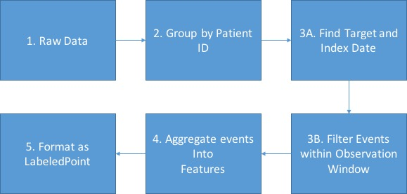
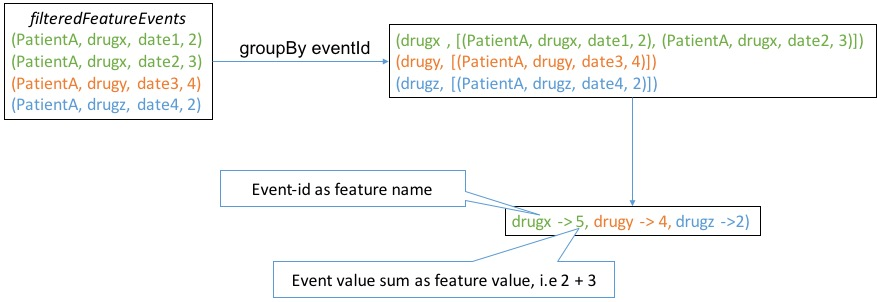
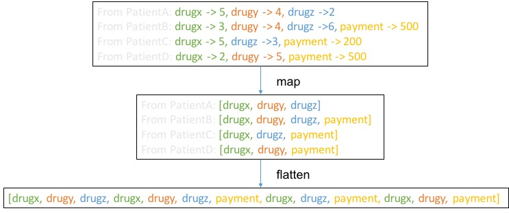
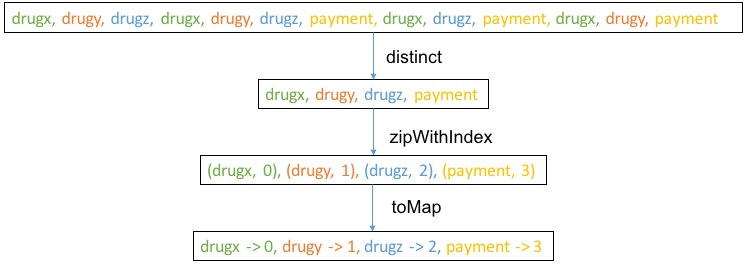

---
---
# Spark Application

::: tip Learning Objectives

- Prepare data for machine learning applications.
- Save/load constructed data to external storage.

:::

In this section, we will show how to prepare suitable data for building predictive models to predict heart failure (HF). We will first briefly introduce data types involved. Then we show how to construct training/testing samples from the input data using Spark. Finally we will export data in suitable format for modeling later.

## Data Types

For many machine learning tasks, such as classification, regression, and clustering, a data point is often represented as a feature vector. Each coordinate of the vector corresponds to a particular feature of the data point.

### Feature Vector

MLlib, the machine learning module of Spark, supports two types of vectors: dense and sparse.
A dense vector is basically a `Double` array of length equals to the dimension of the vector.
If a vector contains only a few non-zero entries, we can then more efficiently represent the vector by a sparse vector with non-zero indices and the corresponding values only.
For example, a vector `(1.0, 0.0, 3.0)` can be represented in dense format as `[1.0, 0.0, 3.0]` or in sparse format as `(3, [0, 2], [1.0, 3.0])`, where 3 is the size of the vector.

The base class of a vector is `Vector`, and there are two implementations: `DenseVector` and `SparseVector`. We recommend using the factory methods implemented in `Vectors` to create vectors.

```scala
scala> import org.apache.spark.mllib.linalg.{Vector, Vectors}

// Create a dense vector (1.0, 0.0, 3.0).
scala> val dv = Vectors.dense(1.0, 0.0, 3.0)

// Create a sparse vector (1.0, 0.0, 3.0) by specifying its nonzero entries.
scala> val sv = Vectors.sparse(3, Seq((0, 1.0), (2, 3.0)))
```

### Labeled Point

A labeled point is a vector, either dense or sparse, associated with a label/prediction target. In Spark MLlib, labeled points are used  as input to supervised learning algorithms. For example, in binary classification like HF prediction, a label should be either 0 or 1. For multiclass classification, labels should be class indices starting from zero: 0, 1, 2, .... For regression problem like payment prediction, a label is a real-valued number.

```scala
scala> import org.apache.spark.mllib.linalg.Vectors
scala> import org.apache.spark.mllib.regression.LabeledPoint

// Create a labeled point with label 1 and a dense feature vector.
scala> val labeled1 = LabeledPoint(1, Vectors.dense(1.0, 0.0, 3.0))

// Create a labeled point with label 0 and a sparse feature vector.
scala> val labeled0 = LabeledPoint(0, Vectors.sparse(3, Seq((0, 1.0), (2, 3.0))))
```

## Feature Construction

### Overview

To apply machine learning algorithms, we need to transform our data into `RDD[LabeledPoint]`. This feature construction is similar to what we did in [Hadoop Pig]({/hadoop/hadoop-pig.html), but will be more concise since we are programming in Scala on Spark. We will need to consider an one-year prediction window. Specifically, we will only use data one year before HF diagnosis. The figure below depicts relationship between prediction window and target.

We can also specify an observation window, inside which data will be used to construct feature vectors. 


High level steps are depicted as the figure below



Our parallelization will be on **patient level**, i.e. each element in RDD is everything about exactly one patient. Feature and prediction target for each patient is almost independent from the others. Recall that our data file is in the following form:

```
00013D2EFD8E45D1,DIAG78820,1166,1.0
00013D2EFD8E45D1,DIAGV4501,1166,1.0
00013D2EFD8E45D1,heartfailure,1166,1.0
00013D2EFD8E45D1,DIAG2720,1166,1.0
....
```

Each line is a 4-tuple `(patient-id, event-id, timestamp, value)`. Suppose now our goal is to predict if a patient will have heart failure. We can use the value associated with the event `heartfailure` as the label. This value can be either 1.0 (the patient has heart failure) or 0.0 (the patient does not have heart failure). We call a patient with heart failure a **positive example** or **case patient**, and a patient without heart failure a **negative example** or **control patient**. 
For example, in the above snippet we can see that patient `00013D2EFD8E45D1` is a positive example. The file **case.csv** consists of only positive examples, and the file **control.csv** consists of only negative examples.

We will use the values associated with events other than `heartfailure` to construct feature vector for each patient. Specifically, the length of the feature vector is the number of distinct `event-id`'s, and each coordinate of the vector stores the aggregated value corresponds to a particular `event-id`. The values associated with events not shown in the file are assume to be 0. Since each patient typically has only a few hundreds of records (lines) compared to thousands of distinct events, it is more efficient to use `SparseVector`.
Note that each patient can have multiple records with the same `event-id`. In this case we sum up the values associated with a same `event-id` as feature value and use `event-id` as feature name.

### 1. Load data

The file **input/case.csv** consists of only positive examples, and the file **input/control.csv** consists of only negative examples. We will load them together. Since the data will be used more than once, we use `cache()` to prevent reading in the file multiple times.

```scala
case class Event(patientId: String, eventId: String, timestamp: Int, value: Double)

val rawData = sc.textFile("input/").
  map{line =>
    val splits = line.split(",")
    new Event(splits(0), splits(1), splits(2).toInt, splits(3).toDouble)
  }
```

### 2. Group patient data

One patient's index date, prediction target etc are independent from another patient, so that we can group by patient-id to put everything about one patient together. When we run `map` operation, Spark will help us parallelize computation on **patient level**.

```scala
// group raw data with patient id and ignore patient id
// then we will run parallel on patient lelvel
val grpPatients = rawData.groupBy(_.patientId).map(_._2)
```

The `groupBy` operation can be illustrated with the example below


Please recall that `_._2` will return second field of a tuple. In this case it will return the `List[event]` for a given patient. Finally the `grpPatients` will be `RDD[List[event]]` 

### 3. Define target and feature values

Now, we can practice our **patient level** parallelization. For each patient, we first find the prediction target, which is encoded into an event with name `heartfailure`, then we identify the index date and keep only useful events before the index date for feature construction. In feature construction, we aggregate the event value into features using `sum` function and use the event name as the feature name.

``` scala
val patientTargetAndFeatures = grpPatients.map{events =>
  // find event that encode our prediction target, heart failure
  val targetEvent = events.find(_.eventId == "heartfailure").get
  val target = targetEvent.value

  // filter out other events to construct features
  val featureEvents = events.filter(_.eventId != "heartfailure")

  // define index date as one year before target
  // and use events happened one year before heart failure
  val indexDate = targetEvent.timestamp - 365
  val filteredFeatureEvents = featureEvents.filter(_.timestamp <= indexDate)

  // aggregate events into features
  val features = filteredFeatureEvents.
    groupBy(_.eventId).
    map{case(eventId, grpEvents) =>
      // user event id as feature name
      val featureName = eventId
      // event value sum as feature value
      val featureValue = grpEvents.map(_.value).sum

      (featureName, featureValue)
    }

  (target, features)
}
```

The construction of target is relatively simple, but the process of constructing features is tricky. The example below show what happened in main body of above `map` operation to illustrate how `features` were constructed



Our final `filteredFeatureEvents` should be `RDD[(target, Map[feature-name, feature-value])]` and we can verify 
that by the following:

```scala
scala> patientTargetAndFeatures.take(1)
res0: Array[(Double, scala.collection.immutable.Map[String,Double])] = Array((0.0,Map(DRUG36987241603 -> 60.0, DRUG00378181701 -> 30.0, DRUG11517316909 -> 20.0, DRUG53002055230 -> 200.0, DRUG23490063206 -> 30.0, DRUG61113074382 -> 60.0, DRUG58016093000 -> 60.0, DRUG52604508802 -> 30.0, DRUG58016037228 -> 10.0, DRUG60491080134 -> 30.0, DRUG51079093119 -> 360.0, DRUG00228275711 -> 30.0, DRUG63629290803 -> 120.0, DIAG4011 -> 1.0, DRUG58016075212 -> 90.0, DRUG00378412401 -> 30.0, DRUG63629260701 -> 30.0, DRUG00839619116 -> 30.0, DRUG11390002315 -> 30.0, DRUG58016058050 -> 60.0, DRUG55289082930 -> 60.0, DRUG36987154502 -> 30.0, DRUG00364095301 -> 30.0, DRUG58016021326 -> 180.0, DRUG54868593401 -> 30.0, DRUG58016054035 -> 30.0, DRUG64464000105 -> 30.0, DRUG58016076573 -> 30.0, DRUG00839710006...
```

### 4. Feature name to id

In the previous step, we computed `filteredFeatureEvents` as `RDD[(target, Map[feature-name, feature-value])]`. In order to convert `feature-name` to some integer id as required by most machine learning modules including MLlib, we will need to collect all unique feauture names and associate them with integer ids.

```scala
// assign a unique integer id to feature name
val featureMap = patientTargetAndFeatures. // RDD[(target, Map[feature-name, feature-value])]
  flatMap(_._2.keys). // get all feature names
  distinct. // remove duplication
  collect. // collect to driver program
  zipWithIndex. // assign an integer id
  toMap // convert to Map[feature-name, feature-id]
```

Here we used an operation named `flatMap`. Below is an example, and we can think of `flatMap` as a two step operation, map and flatten. As a result, `patientTargetAndFeatures.flatMap(_._2.keys)` will give `RDD[feature-name]`.



Next we visualize the steps after `flatMap`:



Here `collect` is not depicted but what `collect` does is to collect data from distributed to centralized storage on the driver. Here we assume the resulting data matrix is not too big. If the data matrix is very big, alternative approach may be required such as join.
Note that many the common functions like `zipWithIndex` have the same name on `RDD` and on common local data structures like `List`.

::: tip

If you get confused about result of certain operations, you can avoid chain of operation calls and instead print out the result of each step.

:::

### 5. Create final `LabeledPoint`

In this last step, we transform `(target, features)` for each patient into  `LabeledPoint`. Basically, we just need to translate feature name in `features` into feautre id and create a feature vector then associate the vector with `target`.

```scala
// broadcast feature map from driver to all workers
val scFeatureMap = sc.broadcast(featureMap)
val finalSamples = patientTargetAndFeatures.map {case(target, features) =>
  val numFeature = scFeatureMap.value.size
  val indexedFeatures = features.
    toList.
    // map feature name to id to get List[(feature-id, feature-value)]
    map{case(featureName, featureValue) => (scFeatureMap.value(featureName), featureValue)}

    val featureVector = Vectors.sparse(numFeature, indexedFeatures)
    val labeledPoint = LabeledPoint(target, featureVector)
    labeledPoint
}
```

Here in above example, we called `sc.broadcast`. As indicated by its name, this function is used for broadcasting data from driver to workers so that workers will not need to copy on demand and waste bandwidth thus slow down the process. Its usage is very simple, call `val broadcasted = sc.broadcast(object)` and use `broadcasted.value` to access original `object`. Please be aware of the fact that such broadcasted object is read-only.

## Save

With data readily available as `RDD[LabeledPoint]`, we can save it into a common format accepted by a lot of machine learning modules, the LibSVM/svmlight format, named after LibSVM/svmlight package.

```scala
import org.apache.spark.mllib.util.MLUtils
MLUtils.saveAsLibSVMFile(finalSamples, "samples")
```

<ExerciseComponent
    question="Save `featureMap` to local file system for future use."
    answer="">

You can achieve this by

```scala
val mapping = featureMap.
  toList.
  sortBy(_._2).
  map(pair => s"${pair._1}|${pair._2}"). // intentionally use special seperator
  mkString("\n")


scala.tools.nsc.io.File("mapping.txt").writeAll(mapping)
```

</ExerciseComponent>